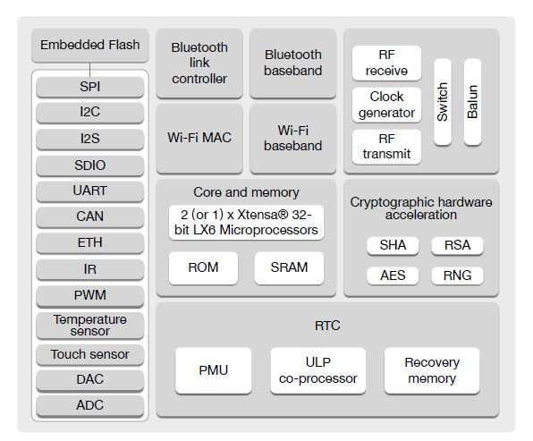

# Introdução à Internet das Coisas (IOT)


## 📌 O que é IoT?

**Internet das Coisas (IoT)** é o conceito de conectar objetos físicos à internet para que eles possam coletar, enviar e/ou receber dados. Esses objetos podem ser sensores, eletrodomésticos, veículos, máquinas industriais, e muito mais.

---

## 🧩 Componentes Principais de um Sistema IoT

1. **Sensores** – Capturam dados do ambiente físico.
2. **Atuadores** – Executam ações físicas com base em comandos.
3. **Microcontrolador** – Interpreta os dados dos sensores e comanda os atuadores (ex: ESP32, Arduino).
4. **Comunicação** – Envia/recebe dados via Wi-Fi, Bluetooth, LoRa, Zigbee, etc.
5. **Plataforma na nuvem ou servidor local** – Armazena, analisa e apresenta os dados.

---

## 🔍 Sensores: O “sentido” dos dispositivos IoT

Sensores são dispositivos que captam variáveis do ambiente. Os dados captados podem ser físicos, químicos ou biológicos.

| Tipo de Sensor        | Função                               | Exemplo                        |
| --------------------- | ------------------------------------ | ------------------------------ |
| Temperatura/Umidade   | Mede clima/ambiente                  | DHT11, DHT22, BME280           |
| Luminosidade          | Mede intensidade da luz              | LDR, BH1750                    |
| Proximidade/Distância | Detecta objetos ou mede distância    | Ultrassônico HC-SR04, IR       |
| Gás e Qualidade do Ar | Detecta fumaça, CO2, álcool, etc.    | MQ-2, MQ-135                   |
| Movimento             | Detecta presença humana              | PIR                            |
| Vibração/Impacto      | Detecta choques e movimentos bruscos | SW-420, acelerômetro MPU6050   |
| Pressão               | Detecta peso ou pressão atmosférica  | BMP180, HX711                  |
| Toque/Capacitivo      | Detecta toque humano                 | TTP223, pinos GPIO capacitivos |
| Som                   | Detecta ruído, palmas, voz           | Microfone analógico, MAX9814   |
| GPS                   | Localização geográfica               | NEO-6M                         |

---

## ⚙️ Atuadores: A “mão” do sistema IoT

Atuadores são componentes que realizam ações físicas com base em comandos recebidos, normalmente do microcontrolador.

| Tipo de Atuador        | Função                                     | Exemplo                   |
| ---------------------- | ------------------------------------------ | ------------------------- |
| LED                    | Sinal visual                               | LED simples, RGB          |
| Buzzer                 | Sinal sonoro                               | Buzzer passivo/ativo      |
| Motor DC               | Gira para movimentar objetos               | Motor DC 5V               |
| Servo Motor            | Movimenta objetos com ângulos precisos     | SG90, MG996R              |
| Relé                   | Liga/desliga dispositivos de alta potência | Módulo relé 5V            |
| Display                | Mostra informações                         | OLED 0.96", LCD 16x2, TFT |
| Fita de LED (Neopixel) | Iluminação colorida                        | WS2812B                   |
| Válvula Solenoide      | Controle de fluxo de líquidos/gases        | 12V Solenoide             |
| Dispensador/Dropper    | Libera pequenas quantidades de material    | Servo adaptado            |

---

## 🔁 Exemplo de Ciclo IoT com Sensor e Atuador

**Aplicação:** Sistema de iluminação automática

1. Sensor de luminosidade (LDR) mede a luz do ambiente.
2. ESP32 lê o valor do sensor.
3. Se a luminosidade estiver baixa, envia sinal para:

   * **Acender um LED** (atuador).
   * **Enviar dado à nuvem** (ex: para log no Grafana via MQTT).
4. Quando a luz natural volta, o sistema desliga o LED.

---

## 🔗 Comunicação entre sensores/atuadores e a nuvem

* **Protocolo MQTT:** Leve e eficiente para IoT (broker como Mosquitto, HiveMQ).
* **HTTP/REST:** Usado para envio de dados a APIs e serviços web.
* **BLE/Wi-Fi:** Comunicação local entre dispositivos móveis e ESP32.
* **Node-RED:** Interface visual para integrar sensores, atuadores e serviços em nuvem.

---

## 📦 Plataformas para projetos IoT

* **ESPHome / Home Assistant** – Integração com automação residencial.
* **Blynk** – App mobile para monitoramento e controle.
* **ThingSpeak** – Plataforma de visualização de dados.
* **Firebase** – Backend em tempo real para dados e autenticação.
* **Grafana + InfluxDB** – Dashboard para análise de dados IoT.

---

## ✅ Dicas para criação de projetos

* Comece com um sensor e um atuador.
* Teste localmente antes de conectar à internet.
* Use protoboard para testes rápidos.
* Documente os valores esperados de sensores.
* Pense em alimentação: baterias, placas solares, ou fonte.

---

### Arquitetura ESP32



Claro! Abaixo está um conteúdo completo e didático sobre **MQTT**, com foco em aplicações para **IoT (Internet das Coisas)**.

---

# 📡 Introdução ao MQTT para IoT

## 🔍 O que é MQTT?

**MQTT (Message Queuing Telemetry Transport)** é um protocolo de comunicação leve, rápido e eficiente, ideal para **dispositivos IoT** com recursos limitados ou que operam em redes instáveis.

Foi criado para permitir a troca de mensagens entre dispositivos (sensores, atuadores, controladores, etc.) por meio de um modelo **publicador/assinante** (publish/subscribe).

---

## 📦 Estrutura Básica do MQTT

### 🧭 Elementos principais:

| Elemento       | Função                                                          |
| -------------- | --------------------------------------------------------------- |
| **Broker**     | Servidor central que gerencia o envio/recebimento das mensagens |
| **Publisher**  | Dispositivo que envia (publica) dados em um tópico              |
| **Subscriber** | Dispositivo que assina (ouve) um tópico para receber mensagens  |
| **Tópico**     | Caminho hierárquico onde as mensagens são publicadas            |
| **Payload**    | O conteúdo da mensagem (texto, número, JSON, etc.)              |

---

### 💬 Exemplo de Comunicação MQTT

1. O ESP32 publica:
   **Tópico:** `casa/sala/temperatura`
   **Payload:** `25.7`

2. Outro dispositivo (ou app) assina esse tópico e recebe esse valor.

---

## 🧱 Exemplo de Tópicos Hierárquicos

```
casa/
├── sala/
│   ├── temperatura
│   ├── umidade
├── cozinha/
│   ├── presença
│   ├── gás
```

Os tópicos podem ser genéricos com **wildcards**:

* `casa/#` → recebe tudo da casa
* `casa/+/temperatura` → recebe temperatura de todos os cômodos

---

## 🔁 Fluxo MQTT: Publicação e Assinatura

```
[Sensor ESP32] --(publica)--> [Broker MQTT] --(distribui)--> [Clientes assinantes]
```

* Os dispositivos **não se comunicam diretamente** entre si.
* O **broker** é o "correio" que entrega as mensagens para quem assinou o tópico correspondente.

---

## 🛠️ Brokers MQTT Populares

| Nome          | Tipo        | Observações                          |
| ------------- | ----------- | ------------------------------------ |
| Mosquitto     | Local       | Leve e rápido, ideal para testes     |
| HiveMQ        | Nuvem       | Fácil de usar e visualizar mensagens |
| EMQX          | Local/Nuvem | Escalável, suporta dashboards        |
| MQTT Explorer | Ferramenta  | Visualização de tópicos e mensagens  |

---

## 🧪 Exemplo Prático: ESP32 + MQTT

### 📋 Requisitos:

* ESP32
* Sensor DHT22 (opcional)
* Wi-Fi
* Broker MQTT (Mosquitto local ou HiveMQ online)

### 🧠 Código básico (ESP32 usando PubSubClient):

```cpp
#include <WiFi.h>
#include <PubSubClient.h>

const char* ssid = "SEU_WIFI";
const char* password = "SENHA_WIFI";
const char* mqttServer = "broker.hivemq.com"; // ou IP local
const int mqttPort = 1883;

WiFiClient espClient;
PubSubClient client(espClient);

void setup() {
  Serial.begin(115200);
  WiFi.begin(ssid, password);
  while (WiFi.status() != WL_CONNECTED) delay(500);

  client.setServer(mqttServer, mqttPort);
}

void loop() {
  if (!client.connected()) {
    client.connect("esp32-client");
  }
  
  String temperatura = "25.4";
  client.publish("casa/sala/temperatura", temperatura.c_str());
  delay(5000);
}
```

---

## 🔐 Qualidade de Serviço (QoS)

| Nível | Garantia                           | Uso ideal                         |
| ----- | ---------------------------------- | --------------------------------- |
| 0     | Sem garantia (fogo e esquece)      | Sensores com dados frequentes     |
| 1     | Garante entrega pelo menos uma vez | Controle de dispositivos          |
| 2     | Garante entrega exatamente uma vez | Transações críticas (pouco usado) |

---

## 📲 Aplicações Comuns de MQTT

* **Automação Residencial:** sensores que ativam lâmpadas, ar-condicionado, alarme.
* **Indústria 4.0:** monitoramento de máquinas em tempo real.
* **Agricultura:** sensores de umidade e temperatura enviando dados para dashboards.
* **Cidades Inteligentes:** controle de semáforos, iluminação pública e coleta de lixo.

---

## ✅ Vantagens do MQTT para IoT

* Muito **leve** (ideal para redes com baixa largura de banda)
* Funciona em **tempo real**
* Facilmente **escalável** para milhares de dispositivos
* Compatível com **qualquer linguagem** (C++, Python, JavaScript, etc.)

---

## 🚀 Recursos Extras

* [MQTT Explorer](https://mqtt-explorer.com/) – Ferramenta gráfica para testes
* [HiveMQ Public Broker](https://www.hivemq.com/demos/websocket-client/) – Testes online
* [Node-RED](https://nodered.org/) – Integração visual com MQTT

---


# 🔌 Conexão entre IoT e Sistemas Embarcados

## 🤖 O que são Sistemas Embarcados?

Um **sistema embarcado** é um computador compacto dedicado a realizar **uma função específica** dentro de um sistema maior. Ele é geralmente composto por:

* **Microcontrolador ou processador (MCU/MPU)**
* **Memória**
* **Interfaces de entrada/saída**
* **Sensores e atuadores**
* **Energia dedicada**

➡️ Exemplos: controle de motor em eletrodoméstico, sensor de estacionamento, relógio digital, sistema de airbag.

---

## 🌐 Onde entra o IoT?

**IoT (Internet das Coisas)** conecta sistemas embarcados à internet, permitindo:

* Comunicação remota com outros dispositivos
* Armazenamento de dados em nuvem
* Monitoramento em tempo real
* Controle e automação à distância

---

## 🔁 Como sistemas embarcados se conectam à IoT?

### 1. **Camada Física e de Hardware**

* Microcontroladores com conectividade:

  * Wi-Fi: ESP32, ESP8266
  * Ethernet: STM32 com módulo LAN8720
  * Bluetooth: Arduino Nano BLE, ESP32
  * LoRa/Zigbee: para longa distância e redes mesh

* Sensores e atuadores (ambiente físico)

---

### 2. **Protocolos de Comunicação**

| Protocolo     | Aplicação comum                        | Características         |
| ------------- | -------------------------------------- | ----------------------- |
| **MQTT**      | Envio de dados para nuvem              | Leve, publish/subscribe |
| **HTTP/REST** | Integração com APIs Web                | Padrão da web           |
| **CoAP**      | Dispositivos com muitos nós            | Leve, parecido com HTTP |
| **WebSocket** | Comunicação bidirecional em tempo real | Boa para dashboards     |
| **Modbus**    | Automação industrial                   | Serial ou TCP/IP        |

---

### 3. **Plataformas de Backend (Servidor/Nuvem)**

* **Firebase**, **ThingSpeak**, **AWS IoT**, **Azure IoT Hub**
* **Bancos de dados**: InfluxDB, MongoDB, PostgreSQL
* **Dashboards**: Grafana, Node-RED, Blynk

---

### 4. **Interfaces e Aplicações**

* **Apps Mobile** (Flutter, React Native)
* **Dashboards Web** (React, Vue, Node.js)
* **Sistemas SCADA ou ERPs** integrados com APIs

---

## 📦 Exemplo Real: Sistema de Irrigação Inteligente

| Camada                | Componente                                                    |
| --------------------- | ------------------------------------------------------------- |
| **Sensor**            | Umidade do solo (capacitivo)                                  |
| **Sistema embarcado** | ESP32                                                         |
| **Conectividade**     | Wi-Fi com protocolo MQTT                                      |
| **Atuador**           | Relé acionando bomba d’água                                   |
| **Nuvem**             | Broker MQTT + Grafana + InfluxDB                              |
| **Interface**         | Aplicativo web/mobile para monitoramento e acionamento remoto |

---

## 🔐 Considerações sobre segurança

* Criptografia TLS em protocolos como MQTT e HTTPS
* Autenticação com tokens ou certificados
* Atualizações OTA (over-the-air) seguras para firmware
* Controle de acesso a APIs e dispositivos

---

## ✅ Benefícios da integração IoT + Sistemas Embarcados

* Acesso remoto a sensores e atuadores
* Monitoramento e controle em tempo real
* Decisões automáticas baseadas em dados
* Redução de custos operacionais
* Facilidade de integração com sistemas maiores (SCADA, ERP, IA)

---

## 📚 Conclusão

A **IoT estende o poder dos sistemas embarcados**, conectando o mundo físico ao digital. Juntos, eles formam a base da automação moderna em casas, indústrias, cidades e agricultura.

---

Se quiser, posso transformar este conteúdo em **apresentação de slides**, **apostila prática com exemplos em código**, ou um **mapa conceitual com fluxos de dados**. Alguma preferência?


# **Referências**

1. [ESP32 - Introdução à arquitetura](https://blog.eletrogate.com/conhecendo-o-esp32-introducao-1/)
1. [Protocolo MQTT](https://aws.amazon.com/pt/what-is/mqtt/)
1. [ESP32 - Led como sensor de luz](https://blog.eletrogate.com/como-usar-um-led-como-sensor-de-luz/)


# *Sugestões de projetos*


### 🔌 **1. Controle de LED por Wi-Fi**

Crie um servidor web para ligar/desligar um LED remotamente.

### 🌡️ **2. Estação de Temperatura e Umidade**

Use o sensor DHT11/DHT22 para exibir dados via página web.

### 📶 **3. Detector de Presença com Notificação Wi-Fi**

Com sensor PIR e envio de alerta para o celular.

### 🎛️ **4. Botão IoT com Ação Webhook**

Ao pressionar, envia requisição para IFTTT, Zapier ou outro serviço.

### 🖥️ **5. Monitor de Ping Wi-Fi**

Verifica se um dispositivo está online (por IP) e alerta se cair.

### 🕹️ **6. Controle de LED com Joystick Analógico**

Use um joystick para variar a intensidade do LED com PWM.

### 📡 **7. ESP32 como Repetidor de Wi-Fi**

Amplifica o sinal Wi-Fi local (modo AP + STA).

### ⏰ **8. Relógio com Sincronização NTP**

Mostra hora exata sincronizada pela internet em display OLED.

### 🏠 **9. Monitor de Portas com Sensor Magnético**

Detecta se a porta está aberta/fechada e registra evento via Wi-Fi.

### 🐦 **10. Sensor de Movimento para Espantar Pássaros**

Aciona um buzzer ou LED quando há movimento.

### 🔊 **11. Alarme com Sirene Simples**

Ativa um buzzer piezo com sensor de vibração ou PIR.

### 🧠 **12. Medidor de Luz Ambiente**

Sensor LDR envia leitura para app no celular via Blynk ou MQTT.

### 🔋 **13. Monitor de Bateria**

Monitora tensão de uma bateria e exibe no serial/web.

### 🌈 **14. LED RGB Wi-Fi Controlado por Interface Web**

Escolha cor e intensidade pela página HTML.

### 🎮 **15. Controle por Bluetooth (ESP32-BLE)**

Use o celular para controlar LEDs ou motores via BLE.

### 🎤 **16. Reconhecimento de Palmas (Sensor de Som)**

Detecta palmas e acende um LED (sem microfone inteligente).

### 📷 **17. Visualizador de Câmera ESP32-CAM**

Transmite vídeo em tempo real na rede local.

### 🚪 **18. Contador de Pessoas com IR**

Detecta entrada/saída de pessoas por sensores IR.

### 🌧️ **19. Sensor de Chuva com Alerta Wi-Fi**

Sensor de chuva envia alerta para celular ou painel web.

### 🔄 **20. ESP32 como Cliente MQTT com LED**

Se inscreve em um tópico MQTT e muda estado do LED conforme mensagem.

### 🔢 **21. Termômetro com Display OLED (I2C)**

Mostra a temperatura ambiente em tempo real com sensor DHT22 ou TMP36.

### 🎮 **22. Game Simples no OLED com Botões (tipo Pong)**

Use botões físicos para jogar um jogo simples em uma tela OLED.

### 🧠 **23. Classificador de Gestos com Acelerômetro (MPU6050)**

Detecta movimentos (como sacudir ou girar) e executa ações diferentes.

### 🏃 **24. Contador de Passos (Pedômetro)**

Usa o acelerômetro para contar passos e mostra no display ou serial.

### 🧯 **25. Detector de Incêndio com Sensor de Fumaça + Temperatura**

Aciona alerta se houver fumaça e temperatura elevada simultaneamente.

### 🔊 **26. Campainha Inteligente com Notificação Wi-Fi**

Botão de campainha envia notificação para celular e aciona buzzer.

### 🧰 **27. Caixa de Ferramentas Inteligente (Sensor de Abertura)**

Detecta quando a caixa foi aberta e envia log via Wi-Fi.

### 🛋️ **28. Controle de Persiana Automático (Motor + LDR)**

Fecha/abre a persiana automaticamente conforme a luz ambiente.

### 📅 **29. Agenda Eletrônica com RTC e Display LCD**

Mostra compromissos do dia sincronizados via web ou armazenados localmente.

### 🎄 **30. Decoração de Natal com LEDs Animados (WS2812)**

Cria efeitos de luz coloridos usando fita de LED endereçável.

### 🛑 **31. Barreira Laser com Alarme**

Dispara alarme quando o feixe laser for interrompido.

### 📦 **32. Controle de Estoque com Leitor RFID**

Cada item com etiqueta RFID pode ser registrado e monitorado.

### 🌐 **33. Navegador Web Serial (ESP32 + comandos AT)**

Permite enviar requisições HTTP via terminal serial.

### 🧼 **34. Dispenser Automático de Álcool Gel**

Sensor detecta mãos e aciona servo motor para liberar gel.

### 🧾 **35. Impressora Térmica com ESP32**

Imprime recibos ou notas com comandos simples via UART.

### 🎭 **36. Medidor de Qualidade do Ar com Tela (MQ-135 + OLED)**

Mostra o índice de qualidade do ar (AQI) em tempo real.

### 🚀 **37. Lançador de Foguete Educacional**

Sistema de contagem regressiva + botão + LED + buzzer para lançar mini foguete.

### 🕹️ **38. Simulador de Dados de Sensor (modo desenvolvedor)**

Gera dados falsos para testes de dashboards IoT.

### 🔍 **39. Leitor de Sensor Analógico com Gráfico Web**

Qualquer sensor analógico (potenciômetro, LDR, etc.) com visualização em gráfico.

### 🧿 **40. Detector de Vibração (Sensor SW-420)**

Detecta impactos ou tremores e aciona LED/buzzer.

